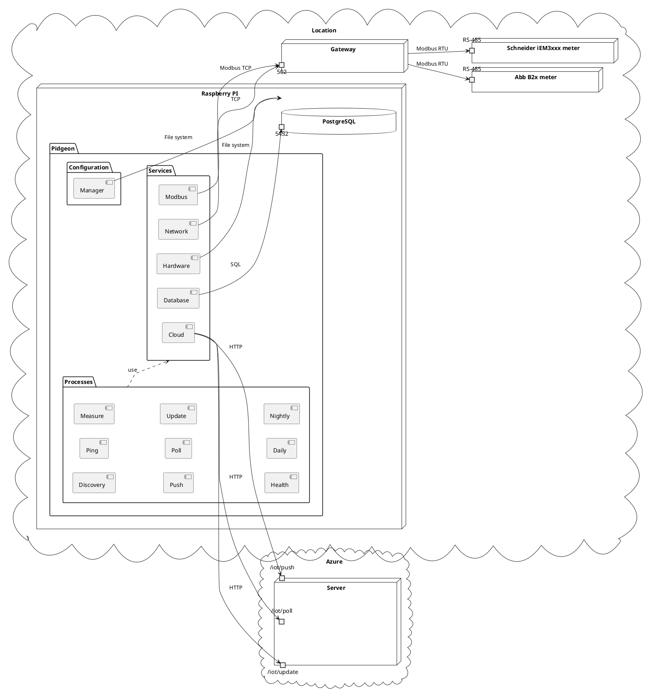

# Architecture

The architecture of Pidgeon is designed to efficiently collect and manage
electrical billing data. The diagram below provides a visual representation of
the system's architecture.

In the context of a location, there are various types of meters, such as the Abb
B2x meter and the Schneider iEM3xxx meter, which are connected via RS-485. The
Gateway, accessible via port 502, serves as an intermediary for data
communication.

The Raspberry Pi hosts the Pidgeon application, which is divided into three main
packages: Configuration, Services, and Processes.

- **Configuration**: This package contains the Manager component, responsible
  for managing the application's configuration.
- **Services**: This package contains several service components:
  - **Hardware**: Interacts with the physical hardware of the Raspberry Pi.
  - **Network**: Manages network communications.
  - **Modbus**: Handles the Modbus protocol for communication with the meters.
  - **Database**: Manages the local PostgreSQL database.
  - **Cloud**: Handles communication with the cloud server.
- **Processes**: This package contains various processes that Pidgeon runs:
  - **Discovery**: Discovers meters on the network.
  - **Ping**: Regularly checks the health of the meters.
  - **Measure**: Takes electrical measurements from the meters.
  - **Health**: Checks the health of Pidgeon and stores it in the local
    database.
  - **Push**: Sends measurements to the cloud server.
  - **Poll**: Polls the cloud server for configuration updates.
  - **Update**: Updates the server of meter and Raspberry PI health.
  - **Daily**: Sets the daily tariff of the meters.
  - **Nightly**: Sets the nightly tariff of the meters.

Please refer to the diagram for a visual representation of these components and
their interactions.

