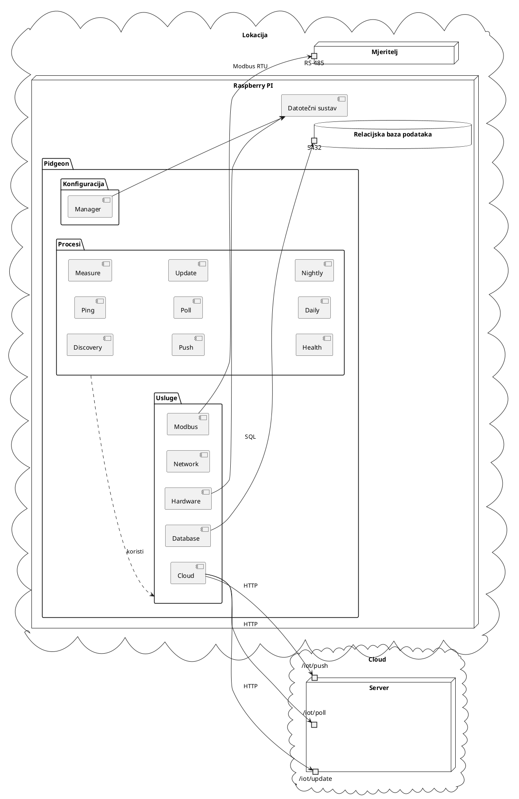

# Arhitektura

Arhitektura Pidgeona dizajnirana je za učinkovito prikupljanje i upravljanje
podacima o električnom napajanju. Dijagram ispod pruža vizualni prikaz
arhitekture sustava.

U kontekstu jedne lokacije postoje različiti tipovi brojila, kao što su Abb B2x
brojilo i Schneider iEM3xxx brojilo, koji su povezani putem RS-485. Gateway,
dostupan putem porta 502, služi kao posrednik za komunikaciju podataka.

Raspberry Pi pokreće Pidgeon aplikaciju, koja je podijeljena na tri glavna
paketa: Konfiguracija, Usluge i Procesi.

- **Konfiguracija**: Ovaj paket sadrži komponentu Manager, odgovornu za
  upravljanje konfiguracijom aplikacije.
- **Usluge**: Ovaj paket sadrži nekoliko servisnih komponenti:
  - **Hardware**: Interagira s fizičkim hardverom Raspberry Pi-a.
  - **Network**: Upravljanje mrežnim komunikacijama.
  - **Modbus**: Upravljanje Modbus protokolom za komunikaciju s mjeriteljima.
  - **Database**: Upravljanje lokalnom PostgreSQL bazom podataka.
  - **Cloud**: Upravljanje komunikacijom s cloud serverom.
- **Procesi**: Ovaj paket sadrži različite procese koje Pidgeon pokreće:
  - **Discovery**: Otkriva brojila na mreži.
  - **Ping**: Redovito provjerava stanje brojila.
  - **Measure**: Preuzima električna mjerenja s brojila.
  - **Health**: Provjerava stanje Pidgeona i pohranjuje ga u lokalnu bazu
    podataka.
  - **Push**: Šalje mjerenja na cloud server.
  - **Poll**: Provjerava cloud server za ažuriranja konfiguracije.
  - **Update**: Ažurira server o stanju brojila i Raspberry PI-a.
  - **Daily**: Postavlja dnevnu tarifu brojila.
  - **Nightly**: Postavlja noćnu tarifu brojila.

Dijagram za vizualni prikaz ovih komponenti i njihovih interakcija:

